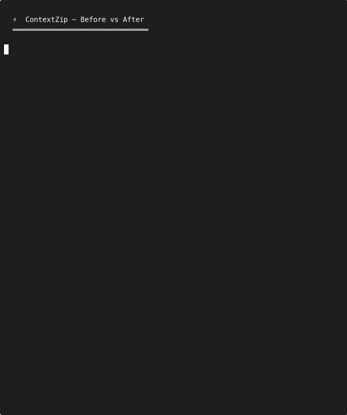

<h1 align="center">
  <br>
  ⚡ ContextZip
  <br>
</h1>

<h3 align="center">
  CLI output eats your AI context window. ContextZip compresses it 40-97% (61% avg across 102 tests).<br>
  <b>v0.2 in progress</b>: session-history compression — the first compressor that touches past tool history, not just live stdout.<br>
  <code>npx contextzip</code>
</h3>

<p align="center">
  <a href="https://github.com/jee599/contextzip/releases"></a>
  <a href="https://github.com/jee599/contextzip/actions"></a>
  
  
  <a href="LICENSE"></a>
</p>

<details>
<summary>🌐 Languages</summary>
<p align="center">
<a href="docs/README.ko.md">한국어</a> •
<a href="docs/README.ja.md">日本語</a> •
<a href="docs/README.zh.md">中文</a> •
<a href="docs/README.es.md">Español</a> •
<a href="docs/README.pt.md">Português</a> •
<a href="docs/README.hi.md">हिन्दी</a> •
<a href="docs/README.fr.md">Français</a> •
<a href="docs/README.de.md">Deutsch</a> •
<a href="docs/README.ru.md">Русский</a> •
<a href="docs/README.tr.md">Türkçe</a> •
<a href="docs/README.vi.md">Tiếng Việt</a>
</p>
</details>

---

<p align="center">
  
</p>

---

## ⬇️ Install

```bash
npx contextzip
```

Restart Claude Code. Every command is now compressed. Zero config.
**macOS · Linux · Windows**

> [!TIP]
> Need raw output? Use `contextzip proxy <command>` to bypass all filters.
> Missing `jq`? Install it: `brew install jq` (macOS) or `apt install jq` (Linux). Required for the Claude Code hook.

<details>
<summary>Other install methods</summary>

```bash
# macOS / Linux
curl -fsSL https://raw.githubusercontent.com/jee599/contextzip/main/install.sh | bash
brew install jee599/tap/contextzip

# Windows (PowerShell)
npx contextzip

# Rust developers
cargo install --git https://github.com/jee599/contextzip
```

</details>

---

## 👀 See the Difference

### 💥 Node.js Error — 30 lines → 3 lines (92% saved)

<table>
<tr>
<td width="50%">

**❌ Before**
```
TypeError: Cannot read properties
  of undefined (reading 'id')
    at getUserProfile (users.ts:47)
    at processAuth (auth.ts:12)
    at Layer.handle (node_modules/
      express/lib/router/layer.js:95)
    ... 25 more node_modules lines
```

</td>
<td width="50%">

**✅ After**
```
TypeError: Cannot read properties
  of undefined (reading 'id')
  → users.ts:47    getUserProfile()
  → auth.ts:12     processAuth()
  (+ 27 framework frames hidden)
💾 saved 92%
```

</td>
</tr>
</table>

### 📦 npm install — 150 lines → 3 lines (95% saved)

<table>
<tr>
<td width="50%">

**❌ Before**
```
npm warn deprecated inflight@1.0.6
npm warn deprecated rimraf@3.0.2
... 45 more deprecated warnings
added 847 packages, audited 848
8 vulnerabilities (2 moderate, 6 high)
  ... 20 more lines
```

</td>
<td width="50%">

**✅ After**
```
✓ 847 packages (32s)
⚠ 8 vulnerabilities (6 high, 2 mod)
⚠ bcrypt@3.0.0: CVE-2023-31484
💾 saved 95%
```

</td>
</tr>
</table>

### 🐳 Docker Build — 50 lines → 1 line (96% saved)

<table>
<tr>
<td width="50%">

**❌ Before**
```
Step 1/12 : FROM node:20-alpine
 ---> abc123def456
Step 2/12 : WORKDIR /app
 ---> Using cache
... 8 more steps with hashes
Successfully tagged my-app:latest
```

</td>
<td width="50%">

**✅ After**
```
✓ built my-app:latest (12 steps, 8 cached)
💾 saved 96%
```

</td>
</tr>
</table>

> [!NOTE]
> Currently supports legacy Docker builder output (`Step N/M` format). Docker BuildKit format passes through uncompressed.

### 🔨 TypeScript Build — 40 errors grouped (81% saved)

<table>
<tr>
<td width="50%">

**❌ Before**
```
src/api/users.ts:47:5 - error TS2322:
  Type 'string' not assignable to 'number'
... 36 more identical errors
Found 40 errors in 8 files.
```

</td>
<td width="50%">

**✅ After**
```
TS2322: 'string' → 'number' (×40)
  users.ts :47, :83
  orders.ts :12, :45
  ... +6 files
💾 saved 81%
```

</td>
</tr>
</table>

<details>
<summary><b>More examples: Rust panic, Python, Web page, ANSI, Docker failure, Java/Go</b></summary>

**🐍 Python Traceback (72% saved)** — Framework frames (`flask`, `importlib`) hidden, your code + error message kept.

**🦀 Rust Panic (2-7% saved)** — `std::panicking`, `tokio::runtime` frames hidden, your crate frames kept.

**🌐 Web Page (73% saved)** — Nav, footer, sidebar, cookie banner, social links stripped. `<main>`/`<article>` content kept.

**🎨 ANSI/Spinners (83% saved)** — Escape codes, spinner frames, intermediate progress bars removed. Final states kept.

**🐳 Docker failure** — Failed step + 2 prior steps + error message + exit code always preserved.

**☕ Java** — Removes `java.lang.reflect`, `sun.reflect`, `org.springframework`, `org.apache` frames.

**🐹 Go** — Removes `runtime/`, `runtime.gopanic`, `runtime.main` frames.

</details>

---

## 📊 The Numbers Don't Lie

> **102 real-world tests. No cherry-picking.**

| Category | Tests | Avg Savings | 🏆 Best | 💀 Worst |
|:---------|------:|:----------:|:-------:|:-------:|
| 🐳 Docker build | 10 | **88%** | 97% | 77% |
| 🎨 ANSI/spinners | 15 | **83%** | 98% | 0% |
| 💥 Error traces | 20 | **59%** | 97% | -12% |
| 🔨 Build errors | 15 | **56%** | 90% | -10% |
| 🌐 Web pages | 15 | **43%** | 64% | 5% |
| 💻 CLI commands | 12 | **42%** | 99% | -56% |
| 📦 Package install | 15 | **39%** | 99% | 2% |

**Weighted total: 61% savings** → 326K chars in, 127K chars out

> [!NOTE]
> Negative = output grew. Happens on tiny inputs. We put the worst numbers in the table because hiding them would be dishonest. [Full benchmark →](docs/benchmark-results.md)

<p align="center">
  <a href="https://github.com/jee599/contextzip">
    
  </a>
</p>

---

## 🆚 Why Not Just RTK?

Built on [RTK](https://github.com/rtk-ai/rtk) (28k⭐). All 34 RTK commands included. **Plus:**

| | RTK | ContextZip |
|:---|:---:|:---:|
| CLI compression (git, test, ls) | ✅ | ✅ |
| Error stacktraces (Node/Python/Rust/Go/Java) | ❌ | ✅ |
| Web page content extraction | ❌ | ✅ |
| ANSI / spinner / decoration removal | 🟡 | ✅ |
| Build error grouping (tsc/eslint/cargo) | 🟡 | ✅ |
| Package install noise (npm/pip/cargo) | ❌ | ✅ |
| Docker build compression | 🟡 | ✅ |
| Per-command savings display | ❌ | ✅ |
| Session-history compression (planned) | ❌ | 🚧 |
| 2026 toolchain coverage (uv/helm/biome/tf, planned) | ❌ | 🚧 |

---

## 🗺️ What's Next (v0.2)

ContextZip today compresses **live stdout**. We measured 6,850 assistant messages across 10 real Claude Code sessions and found:

| Layer | Share of context |
|---|---|
| Tool inputs (Edit/Write/Bash/Read/Agent args) | **46.4%** |
| Tool results (Read/Bash/Agent outputs) | **39.4%** |
| User text | 10.1% |
| Assistant text | 4.1% |

**85.8% of context = tool history.** ContextZip currently only touches the *live Bash stdout* slice. v0.2 introduces the first compressor that operates on **past** tool history, not just real-time output.

```bash
contextzip compact <session-id>   # writes a reversible sidecar
contextzip apply   <session-id>   # atomic swap; original kept as .bak
contextzip expand  <session-id>   # roll back to .bak; sidecar preserved
```

v0.2 ships **two safe axes only** — `BashHistoryCompact` (re-apply text filters to past Bash results, idempotent) and `ReadDedup` (collapse repeated reads of the same file path into a reference). First measurement on a real 55 MB session: **6.7% saved across 2,475 records** (153 ReadDedup + 44 BashHistoryCompact). Sessions vary; honest target band is 6-12% with zero task-failure regressions. The three commands form a safe loop: `compact` writes a sidecar without touching the original, `apply` swaps the sidecar in (always with a `.bak` backup), `expand` rolls back byte-for-byte.

**Other v0.2 tracks** (full design [here](docs/superpowers/specs/2026-04-17-contextzip-advancement-design.md)):
- Upstream catch-up — rtk v0.31~0.36 fixes (git/aws/clippy/runner)
- New filters — `uv` (Python), `gradle`/`mvn` (JVM), `mise`, `helm`, `terraform`, `biome`
- Stability — test coverage for `env_cmd` / `verify_cmd` / `wget_cmd`
- DSL polish — env var substitution + per-platform filters

Short version in [`ROADMAP.md`](ROADMAP.md).

---

## 🛡️ Nothing Important Gets Lost

| | |
|:---|:---|
| 🔴 Error messages | **ALWAYS** preserved |
| 📍 File:line in build errors | **NEVER** removed |
| 🔒 Security warnings (CVE, GHSA) | **ALWAYS** kept |
| 🐳 Docker failure context | **ALWAYS** preserved |
| ⏎ Exit codes | **ALWAYS** propagated |

> [!IMPORTANT]
> ContextZip only removes **confirmed noise**. When in doubt → passthrough.

<details>
<summary><b>🏎️ How It Works</b></summary>

```
  ┌─────────────────────────────────────────────┐
  │  Claude Code runs: git status               │
  │                         ↓                   │
  │  Hook rewrites → contextzip git status      │
  │                         ↓                   │
  │  ┌──────────────────────────────────────┐   │
  │  │ [1] ANSI preprocessor    strip junk  │   │
  │  │ [2] Command router    40+ filters    │   │
  │  │ [3] Error post-proc   compress stack │   │
  │  │ [4] SQLite tracker    record savings │   │
  │  └──────────────────────────────────────┘   │
  │                         ↓                   │
  │  Compressed output → Claude's context       │
  │  💾 contextzip: 200 → 40 tokens (80%)       │
  └─────────────────────────────────────────────┘
```

</details>

<details>
<summary><b>🔧 Commands</b></summary>

```bash
# Automatic (hook rewrites — no prefix needed):
git status    npm install    cargo test    docker build .

# Manual:
contextzip web https://docs.example.com    # page → content only
contextzip err node server.js              # error-focused output

# Analytics:
contextzip gain                  # dashboard
contextzip gain --by-feature     # per-filter stats
contextzip gain --graph          # daily chart

# Manage:
contextzip init --show    contextzip update    contextzip uninstall
```

</details>

<details>
<summary><b>📈 Track Everything</b></summary>

```bash
$ contextzip gain
📊 ContextZip Token Savings
════════════════════════════════════════
Total commands:    2,927
Tokens saved:      10.3M (89.2%)

$ contextzip gain --by-feature
Feature        Commands  Saved     Avg%
cli (RTK)      2,100     6.8M     78%
error          89        1.2M     93%
web            43        0.9M     73%
build          112       0.4M     81%
```

</details>

---

## 🤝 Contribute

```bash
git clone https://github.com/jee599/contextzip.git && cd contextzip
cargo test         # 1,103 tests
cargo clippy       # lint
```

Working on a track from the [roadmap](ROADMAP.md)? Open an issue first so we can confirm scope and avoid double work.

## 📡 Telemetry

ContextZip collects anonymous usage statistics (command count, savings percentage) to improve the tool. No personal data or command content is transmitted.

**Disable:** `export CONTEXTZIP_TELEMETRY_DISABLED=1`

## 📜 License

MIT — Fork of [RTK](https://github.com/rtk-ai/rtk) by rtk-ai.

---

<p align="center"><b>⚡ Less noise. More code. Ship faster.</b></p>

[](https://star-history.com/#jee599/contextzip&Date)
